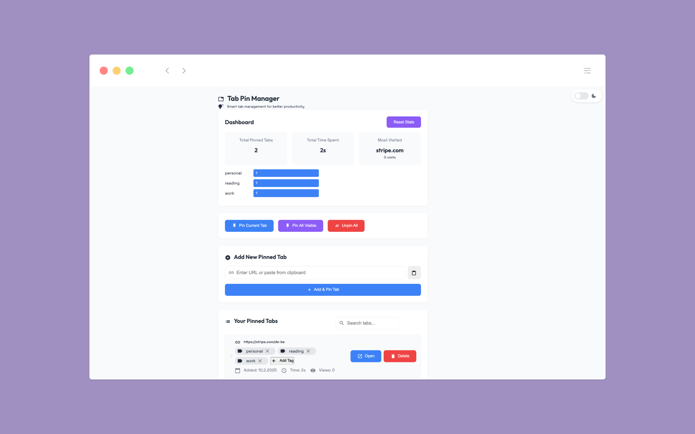

# Tab Pin Manager Chrome Extension

A powerful Chrome extension for managing pinned tabs with advanced features for productivity and organization.

## Features

### Core Functionality
- 📌 Pin/unpin tabs with one click
- 🔄 Automatic tab restoration on browser startup
- 🎯 Quick pin current tab
- 📋 Clipboard support for quick URL pasting
- 🏷️ Tag management system
- 📊 Usage analytics and time tracking
- 🔄 Drag-and-drop tab reordering

### Batch Operations
- 📍 Pin all visible tabs at once
- 🗑️ Unpin all tabs
- 💾 Bulk import/export of pinned tabs
- 🔄 Session backup and recovery

### Smart Features
- 🔍 Quick search through pinned tabs
- 📊 Usage statistics and insights
- ⚡ Instant tab switching
- 🔄 Auto-sync across browser sessions
- 🏷️ Smart tag suggestions
- ⏱️ Time tracking per tab

### User Experience
- 🎨 Clean, modern interface
- 📱 Responsive design for all window sizes
- ⌨️ Keyboard shortcuts support
- 🔔 Visual feedback for actions
- 📊 Statistical dashboard

## Installation

### Chrome Web Store
Coming soon! The extension will be available on the Chrome Web Store.

### Manual Installation
1. Download or clone this repository
2. Open Chrome and go to `chrome://extensions/`
3. Enable "Developer mode"
4. Click "Load unpacked" and select the extension directory

## Usage

### Basic Operations
- Click the extension icon to open the management page
- Enter a URL and click "Add & Pin Tab" to pin a new tab
- Use the search bar to quickly find pinned tabs
- Click "Open" to switch to a pinned tab
- Click "Delete" to unpin and remove a tab

### Tag Management
- Add tags to organize your pinned tabs
- Click "+ Add Tag" on any tab to add tags
- Use suggested tags or create custom ones
- Filter tabs by tags
- Remove tags by clicking the 'x' button

### Keyboard Shortcuts
- `Ctrl+Shift+P` (Windows) / `Cmd+Shift+P` (Mac): Quick pin current tab
- `Enter` in URL input: Add and pin tab
- `Ctrl+F` / `Cmd+F`: Focus search bar
- `Esc`: Clear search/Close dialogs

### Statistics and Analytics
- View total time spent on each pinned tab
- Track access frequency
- Analyze usage patterns
- Reset statistics as needed

### Backup & Restore
- Click "Export Tabs" to save your pinned tabs configuration
- Click "Import Tabs" to restore from a backup file
- Automatic session backup every minute

## Troubleshooting

### Common Issues
1. **Tabs not restoring on startup**
   - Ensure the extension has the necessary permissions
   - Check if Chrome is up to date

2. **Tags not saving**
   - Clear extension storage and try again
   - Check for storage quota limits

3. **Statistics not updating**
   - Refresh the options page
   - Check if time tracking is enabled

### Data Recovery
- Use the session backup feature to recover lost tabs
- Check the extension's local storage for backup data
- Import from previously exported configurations

## Development

### Project Structure

├── manifest.json     # Extension configuration
├── options.html      # Main interface
├── options.js        # Core functionality
├── background.js     # Background processes
├── styles.css        # Styling
└── icons/           # Extension icons

### Technical Features
- Chrome Storage API for persistence
- Tab management API integration
- Event handling for browser actions
- Responsive design with CSS
- Tag management system
- Analytics tracking

## Updates

### Version 1.4 (Latest)
- Added dark mode support with theme toggle
- Enhanced UI contrast and accessibility
- Improved theme switch transitions
- Added theme persistence across sessions
- Updated icons and visual elements for dark theme
- Fixed material icons visibility in dark mode
- Optimized color schemes for both themes
- Enhanced readability in dark environment

### Version 1.3
- Fixed manual unpinning synchronization
- Improved tab restoration reliability
- Enhanced error handling for tab operations
- Fixed drag-and-drop reordering issues
- Added better storage sync mechanisms
- Improved tab status tracking
- Fixed session backup/recovery edge cases
- Added URL validation improvements
- Enhanced dashboard update reliability
- Added toast notifications for all tab operations

### Version 1.2
- Added tag management system
- Implemented drag-and-drop reordering
- Added time tracking and analytics
- Enhanced statistics dashboard
- Added session backup/recovery
- Improved UI/UX with toast notifications

### Version 1.1
- Added keyboard shortcuts
- Improved tab restoration
- Added basic statistics tracking
- Enhanced UI/UX

### Version 1.0
- Initial release with core functionality

## Roadmap
- [ ] Cloud sync support
- [ ] Custom icons for pins
- [ ] Folder organization
- [ ] Tab preview functionality
- [ ] Undo/redo support
- [ ] Data migration tools

## Contributing

Feel free to submit issues and enhancement requests! Pull requests are welcome.

## License

This project is licensed under the MIT License - see the LICENSE file for details

## Privacy Policy

This extension only stores data locally and does not transmit any information to external servers. All statistics and configurations are saved in your browser's local storage.